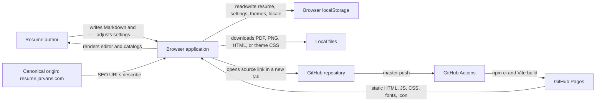
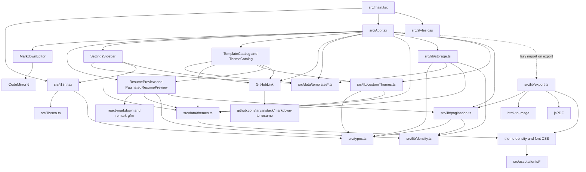
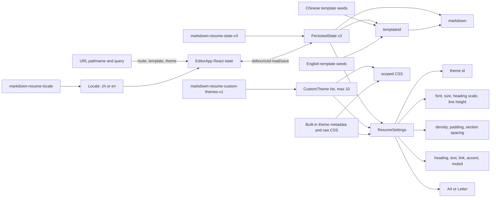
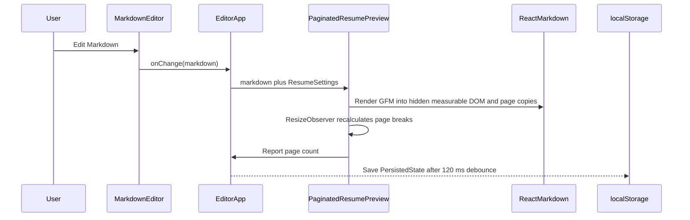
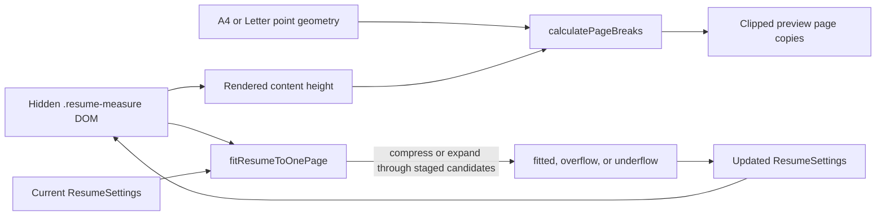
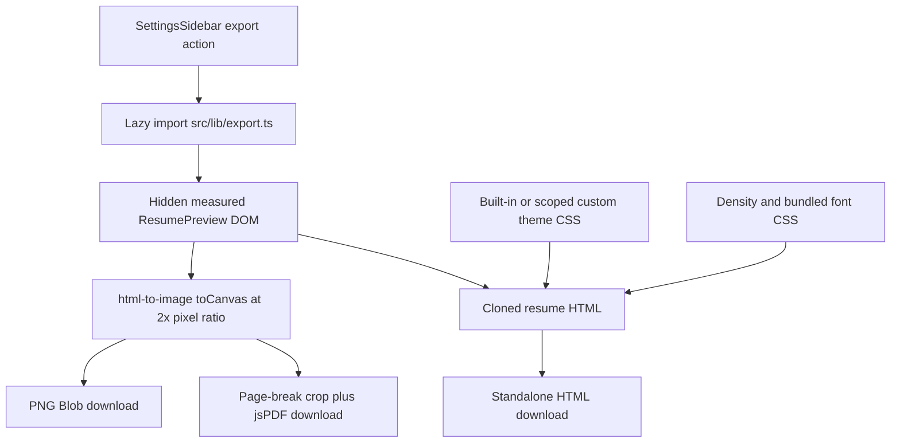
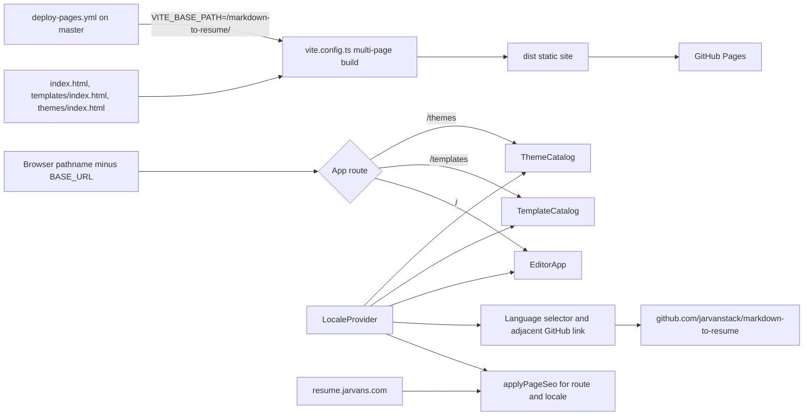

# Markdown To Resume Knowledge Graph

## Graph Metadata

- Canonical file: `docs/knowledge-graph.md`
- Last verified: 2026-07-11
- Architecture: client-only React single-page application with three HTML entry points
- Runtime boundary: browser; no application backend or remote resume-content service
- Persistence boundary: browser `localStorage`
- Maintenance rule: every repository change must update this file and append the change ledger; see `AGENT.md`

## System Context

The application does not upload resume content. Network delivery is limited to loading the deployed static site and any user-authored external links or images rendered from Markdown.

## Module Dependency Graph

Dashed edges are runtime lazy loads. Component node labels map to files in `src/components/`.

## Data And Ownership Graph

`ResumeSettings` is the highest-impact shared data contract. Its consumers are settings UI, built-in themes, custom themes, storage migration, preview CSS variables, smart fitting, pagination, and export.

## Runtime Flows

### Edit, Preview, And Persist

Selecting a template replaces Markdown. Selecting a built-in theme changes only the theme id while preserving current adjustments; selecting a custom theme loads its saved `ResumeSettings`. Locale changes replace template Markdown only when the user has not edited the previous locale's template text.

### Pagination And Smart One-Page

Page breaks prefer rendered block and section boundaries. Smart fitting temporarily applies CSS variables to the canonical measured DOM, respects readable minimums, restores temporary inline values, and returns settings for React to own.

### Export

### Routing, Locale, SEO, Build, And Deploy

The catalog HTML files contain route-specific static metadata for crawlers; runtime SEO then synchronizes title, description, canonical URL, Open Graph, Twitter, and document language.

## Node Catalog

| Node | Path | Owns | Main consumers or dependencies |
| --- | --- | --- | --- |
| Bootstrap | `src/main.tsx` | React root and provider composition | `App`, `LocaleProvider`, global styles |
| Route and use-case coordinator | `src/App.tsx` | Route choice, editor state, template/theme selection, fit/export commands | All workspace components and core libraries |
| Locale and messages | `src/i18n.tsx` | Locale detection, selection, persistence, Chinese/English UI text | All user-facing pages, SEO |
| Shared domain contracts | `src/types.ts` | Theme, paper, export, locale, settings, persisted-state types | Data, components, storage, pagination, export |
| Markdown editor | `src/components/MarkdownEditor.tsx` | Controlled CodeMirror adapter | `EditorApp`, CodeMirror |
| Resume rendering | `src/components/ResumePreview.tsx` | Markdown rendering, CSS variables, measured DOM, clipped page copies | Workspace, catalogs, pagination |
| Settings UI | `src/components/SettingsSidebar.tsx` | User controls and export-format selection | `EditorApp`, theme/template data, i18n |
| Catalog pages | `src/components/CatalogPages.tsx` | Theme/template discovery and custom-theme operations | Preview, data, i18n, custom themes |
| GitHub repository link | `src/components/GitHubLink.tsx` | Shared accessible source-repository control and `github.com/jarvanstack/markdown-to-resume` destination | Editor mobile header, settings desktop header, catalog headers, Lucide icon |
| Panel chrome | `src/components/PanelHeader.tsx` | Editor/preview headings | `EditorApp`, icon asset |
| Template data | `src/data/templates.ts`, `src/data/templates.en.ts` | 18 aligned role templates per locale and quick-template ids | App, settings, catalogs, storage defaults |
| Built-in theme data | `src/data/themes.ts` | 11 themes, defaults, names, raw scoped CSS, font stacks | App, settings, catalogs, preview, storage |
| State persistence | `src/lib/storage.ts` | v3 state storage key, defaults, parse fallback, missing-field merge | `EditorApp` |
| Custom themes | `src/lib/customThemes.ts` | Theme storage, max-10 retention, CSS serialization/import/scoping | App and theme catalog |
| Density model | `src/lib/density.ts` | Normalization and interpolated structural CSS variables | Preview, pagination, storage |
| Pagination and fitting | `src/lib/pagination.ts` | Paper geometry, measurement, breaks, readable fit stages | Preview and export; commanded by App |
| Export | `src/lib/export.ts` | Browser-side PNG, PDF, and standalone HTML downloads | Lazy-loaded by App |
| SEO | `src/lib/seo.ts` | `resume.jarvans.com` canonical origin, locale/route metadata, and DOM application | LocaleProvider, route HTML, SEO tests |
| Application styles | `src/styles.css` | Workspace, preview pages, sidebar, catalogs, responsive layout | Loaded by bootstrap |
| Theme styles | `src/themes/*.css` | Theme appearance, density rules, bundled font faces | Theme data, preview, HTML export |
| Font and public assets | `src/assets/fonts/*`, `public/*` | Export-safe fonts, icon, robots, sitemap | Theme CSS, HTML entries, deployment |
| HTML route entries | `index.html`, `templates/index.html`, `themes/index.html` | Initial document and crawlable route metadata | Vite multi-page build |
| Build and test config | `vite.config.ts`, `tsconfig*.json`, `playwright.config.ts`, `package.json` | Compile, bundle, scripts, unit and browser-test setup | Local development and CI |
| Deployment | `.github/workflows/deploy-pages.yml` | GitHub Pages build and publication | GitHub Actions, Vite base path |
| Unit tests | `src/lib/storage.test.ts`, `src/lib/seo.test.ts` | Storage/i18n/template/theme and SEO contracts | Vitest/jsdom |
| End-to-end tests | `e2e/app.spec.ts`, `e2e/seo.spec.ts` | Integrated browser behavior and route crawlability | Playwright/Chromium/dev server |
| Change policy | `AGENT.md`, `AGENTS.md` | Mandatory plan, graph, and verification workflow | Every future change |
| Change plans | `docs/plan/*.md` | Durable intent, scope, execution, risk, and result history | Change policy and graph ledger |

## Architectural Invariants

1. The application remains usable as static files and has no required application backend.
2. Resume content, selected template, settings, custom themes, and locale remain local to the browser unless the user explicitly downloads a file.
3. Stored state uses the v3 key and is normalized to `PersistedState.version === 3`; JSON parse failures fall back to defaults and absent top-level/settings fields inherit defaults.
4. The hidden measured resume and the visible clipped page copies render the same Markdown and settings. Pagination, smart fitting, preview count, and PDF cropping must agree on its geometry.
5. CSS variables produced by `resumeStyle` and `densityStyleVariables` are the bridge from `ResumeSettings` to built-in/custom theme CSS.
6. Built-in and imported theme selectors remain scoped to their theme class so resume CSS cannot style the application shell.
7. Custom themes retain at most ten entries, newest updates win, and imported CSS metadata reconstructs a complete `ResumeSettings` object.
8. Chinese and English templates share stable ids so locale switches and template links refer to the same role.
9. User-edited Markdown is not overwritten during a locale change; only an untouched current template is replaced by its localized counterpart.
10. `/`, `/templates`, and `/themes` must work under both root development URLs and the configured deployment base path, while canonical SEO URLs use `https://resume.jarvans.com`.
11. PDF page geometry uses the same A4/Letter point definitions and page-break calculation as live preview.
12. Every repository change has a detailed `docs/plan/*.md` record and a corresponding knowledge-graph ledger update.
13. Every application header variant that exposes the language selector renders the shared GitHub repository link immediately after it; the external destination opens in a separate, non-opener browser context.

## Change Impact Map

| Change area | Inspect and usually update together | Minimum focused verification |
| --- | --- | --- |
| `ResumeSettings` or defaults | `types.ts`, `themes.ts`, `storage.ts`, `customThemes.ts`, `ResumePreview.tsx`, `pagination.ts`, `SettingsSidebar.tsx`, export CSS | Storage unit tests plus relevant E2E settings, fit, and export tests |
| Markdown rendering | `MarkdownEditor.tsx`, `ResumePreview.tsx`, theme/global CSS, export | E2E Markdown coverage and all export formats |
| Pagination or paper size | `pagination.ts`, `ResumePreview.tsx`, `export.ts`, preview CSS, settings | E2E pagination, smart-fit, PDF tests |
| Built-in theme or font | `themes.ts`, `src/themes/`, font assets, custom-theme serialization | Theme selection/reset/download/import and visual/export checks |
| Custom themes | `customThemes.ts`, App theme state, `CatalogPages.tsx`, `SettingsSidebar.tsx` | Theme save/reset/import/rename/delete E2E tests |
| Templates | Both locale data files, quick ids, catalogs, storage default/migration | Template/resource unit tests and locale/catalog E2E tests |
| Locale or UI copy | `i18n.tsx`, both template sets, SEO if searchable, affected components | Locale persistence/switch E2E and resource parity unit tests |
| Route or SEO | App path selection, route HTML entry, `seo.ts`, sitemap/robots, Vite inputs | SEO unit and E2E tests plus production-base build |
| Export | `export.ts`, canonical preview DOM, pagination, theme/font/density CSS | PNG, PDF, HTML E2E tests |
| Responsive layout | `styles.css`, workspace/catalog components | Desktop and mobile E2E assertions/screenshots |
| Header actions or external repository links | `App.tsx`, `SettingsSidebar.tsx`, `CatalogPages.tsx`, shared action component, `styles.css` | E2E destination, security attributes, DOM order, and desktop/mobile/catalog visual checks |
| Build or deployment | `package.json`, Vite/TS/Playwright config, workflow, three HTML inputs | `npm run check` and base-path build where relevant |
| Policy or documentation only | `AGENT.md`, related plan, affected graph sections and ledger | Path/link review and `git diff --check` |

## Test Protection Map

| Test suite | Protects |
| --- | --- |
| `src/lib/storage.test.ts` | Defaults, persisted-state validation/migration, template/theme completeness, locale detection/message parity |
| `src/lib/seo.test.ts` | Route resolution and locale-specific runtime metadata |
| `e2e/app.spec.ts` | Locale behavior, workspace and header actions, external-repository link placement/security, themes, templates, fonts, Markdown/GFM, persistence, preview pagination, smart fitting, three export formats, responsiveness, screenshots |
| `e2e/seo.spec.ts` | Independent crawlable HTML responses and runtime canonical/content for templates and themes |
| `npm run build` | TypeScript project references and all three Vite entry bundles |
| `npm run check` | Unit tests, production build, and Chromium E2E suite in sequence |

## Repository Boundaries

Tracked source and documentation are authoritative. The following are generated, installed, local, or ignored and are not graph nodes unless a task explicitly changes their production process: `node_modules/`, `dist/`, `artifacts/`, `output/`, `test-results/`, `tmp/`, `doc/`, `*.tsbuildinfo`, and generated `vite.config.js` or `playwright.config.js` files.

## Change Ledger

Every change must append a row. “Graph update” names the relationships or sections reviewed; a ledger-only update is permitted only when the final source diff creates no architecture, data-flow, runtime-flow, ownership, invariant, or test-map change.

| Date | Plan | Changed nodes | Graph update |
| --- | --- | --- | --- |
| 2026-07-11 | [`Project knowledge graph and change protocol`](plan/2026-07-11-project-knowledge-graph.md) | `AGENT.md`, `AGENTS.md`, `docs/plan/*.md`, `docs/knowledge-graph.md` | Established the complete baseline graph and governance nodes/edges; synchronized the baseline with the current `resume.jarvans.com` SEO origin without modifying application runtime files. |
| 2026-07-11 | [`Add GitHub repository link to header actions`](plan/2026-07-11-github-repository-link.md) | `GitHubLink`, `EditorApp`, `SettingsSidebar`, `CatalogPages`, application styles, E2E tests | Connected all language-bearing header variants to the source repository through the shared adjacent link, recorded its new-tab security invariant, and expanded header-action impact and test coverage. |
